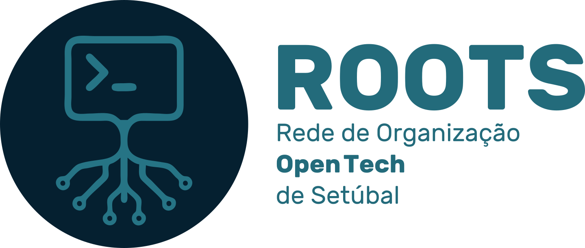

O **ROOTS** é um grupo informal da **Escola Superior de Tecnologia de Setúbal** dedicado a **Linux**, **_software livre_**, **desenvolvimento _open source_** e **_hardware aberto_**.

🎯 O ROOTS tem os seguintes objetivos:

* Criar uma comunidade colaborativa em torno de tecnologias abertas;

* Promover workshops práticos sobre Linux, Git, programação e hardware;

* Envolver participantes em projetos reais, desde software até soluções integradas de hardware/software;

* Ser um espaço de partilha, aprendizagem e inovação.

> [!NOTE]
> ❤️ O ROOTS está aberto a toda a comunidade do **Instituto Politécnico de Setúbal (IPS)**: estudantes, docentes e funcionários. Não é necessária experiência prévia - apenas curiosidade, vontade de aprender e espírito de colaboração.

## 🙋 Como participar

És um membro do IPS? Novos membros são sempre bem-vindos!

Se tens interesse em participar, consulta o repositório [roots-hub](https://github.com/roots-ips-pt/roots-hub) para conhecer as normas, processos e canais de comunicação.

## 🌐 Estrutura da organização

A nossa organização está estruturada em dois repositórios principais:

* [roots-hub](https://github.com/roots-ips-pt/roots-hub) — Documentação institucional, normas internas, recursos comuns e orientações de trabalho.

* [roots-projects](https://github.com/roots-ips-pt/roots-projects) — Estrutura agregadora dos projetos ativos, incluindo templates, convenções e referências para os repositórios individuais de cada iniciativa.

Cada projeto do grupo possui um repositório próprio, com autonomia técnica e acompanhamento colaborativo.

## 🗣️ Política de Idioma / Language Policy

**Resumo / Summary**

* 📢 Comunicação interna / Internal communication → Português

* 📝 Documentação técnica de projetos / Technical documentation → English

🇵🇹 **Português (PT-PT)**

Toda a comunicação interna do grupo ROOTS — incluindo reuniões, atas, discussões informais, e issues relacionadas com ideias, organização e coordenação — deve ser realizada em português europeu.

O objetivo é garantir inclusão, participação fácil de todos os membros e fluidez no trabalho colaborativo.

🇬🇧 **English (EN)**

All project documentation intended for a broader audience — such as README.md, wikis, API documentation, and contributor guidelines — should be written in English.

This ensures accessibility to the international open-source community and helps ROOTS projects grow beyond the local context.

